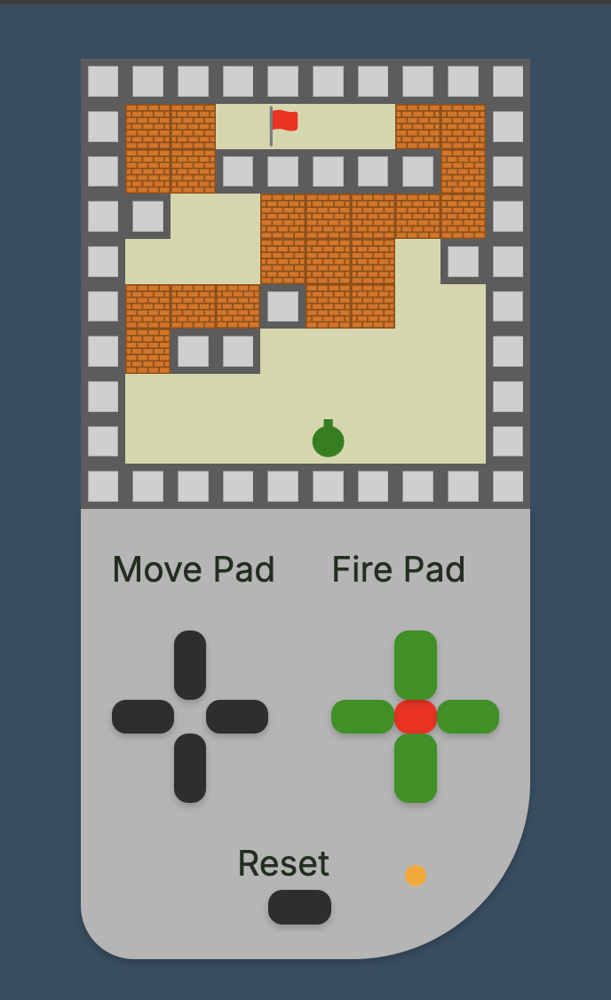

# Game- Tank to the flag

## Table of contents

- [Overview](#overview)
  - [The challenge](#the-challenge)
  - [Screenshot](#screenshot)
  - [How to play](#how-to-play)
  - [Links](#links)
- [My process](#my-process)
  - [Built with](#built-with)
  - [Plan / MVP Build Flow ](#plan--mvp-build-flow)
  - [What I learned](#what-i-learned)
  - [What I practiced](#what-i-practiced)
  - [Continued development](#continued-development)
  - [Useful resources](#useful-resources)
- [Author](#author)

## Overview

### The challenge

- Designed and built a full functioning browser based game using HTML, SCSS and TypeScript
- Completed the project in one week
- Took a mobile-first approach, ensuring the game worked well on both desktop and mobile devices

### Screenshot

 <table> <tr> <td align="center"><strong>Mobile</strong></td> <td align="center"><strong>Mobile Dark Mode</strong></td> <td align="center"><strong>Desktop</strong></td> </tr> <tr> <td></td> <td></td> <td></td> </tr> </table> 

### How to play

- 🕹️ Use **W A S D** or the **on-screen move pad** to move your tank
- 🎯 Use **I J K L** or the **on screen fire pad** to aim your tank’s cannon
- 🔫 Press **F** or the **on screen fire button** to shoot bullets
- 🚩 Your goal is to **navigate the tank to the flag** and capture it
- 🧱 You can shoot through **walls** to clear paths
- 🔁 Press the **Reset** button to restart the game

### Links

- [Solution URL](https://github.com/edpau/no_game)
- [Live Site URL](https://edpau.github.io/no_game/)

## My process

### Built with

- TypeScript
- HTML
- SCSS
- CSS Grid
- Mobile-first workflow

## Plan / MVP Build Flow

- Please read about how I broke down and built the core features step by step in [Plan / MVP Build Flow](./docs/PLAN.md)

### What I learned

- Please read my [Learning Log](./docs/LEARNING.md) here

### What I practiced

- Git
  - Created separate branches for new features
  - Wrote clear commit messages (e.g. feat:, fix:, refactor:)
- CSS & UI
  - Used clamp() to make layout responsive across different screen sizes
  - Disabled user-select and double-tap zoom for better mobile experience
- Debugging & Performance
  - Checked for memory leaks using Chrome Task Manager

### Continued development

#### Gameplay Features

- Add a help dialog to explain the game and show key controls
- Implement a cooldown system to prevent firing too rapidly via keyboard or button spam
- Limited the ammo in the tank
- Reuse the existing Tank class for CPU tanks
- Reuse the Bullet class for CPU tanks
- Add random enemy tanks that spawn at intervals
- Add random landmines on the map for surprise element

#### UI Improvements

- Mirror keyboard input to visually highlight the corresponding on-screen buttons
- Highlight the currently selected fire direction with different color

### Useful resources

- [Casting object keys to numbers](https://www.reddit.com/r/typescript/comments/z61u2d/is_there_a_way_to_avoid_explicitly_casting_object/)
- [Understanding Memory Management and Garbage Collection in JavaScript](https://medium.com/%40aayushpatniya1999/understanding-memory-management-and-garbage-collection-in-javascript-%EF%B8%8F-27e2723f9a2)
- [Object pools in high performance javascript?](https://stackoverflow.com/questions/8410667/object-pools-in-high-performance-javascript)
- [Particle Pool for JavaScript Game Engines](https://www.youtube.com/watch?v=9dp0mAc2vvY)
- [JavaScript game; bullets in array; when I shoot, ALL bullets in array refire from wherever the player is](https://stackoverflow.com/questions/16617525/javascript-game-bullets-in-array-when-i-shoot-all-bullets-in-array-refire-fro)
- [How to Shoot Bullets in JavaScript - Game Dev](https://www.youtube.com/watch?v=i7FzA4NavDs)
- [Need a better way to share variables among modules](https://www.reddit.com/r/learnjavascript/comments/1dv0qnp/need_a_better_way_to_share_variables_among_modules/)
- [T-rex run in JavaScript! (Youtube)](https://www.youtube.com/watch?v=OnkimGiEkb4)
- [The Alternative Guide to Building Tetris with JavaScript - Video for The Ultra Beginner (Youtube)](https://www.youtube.com/watch?v=w1JJfK09ujQ)
- [https://www.youtube.com/watch?v=q2ViNbRwr5U&t=818s (Youtube)}](https://www.youtube.com/watch?v=q2ViNbRwr5U&t=818s)

## Author

- Website - [Edward Pau](https://www.edpau.me)
- Frontend Mentor - [@edpau](https://www.frontendmentor.io/profile/edpau)
